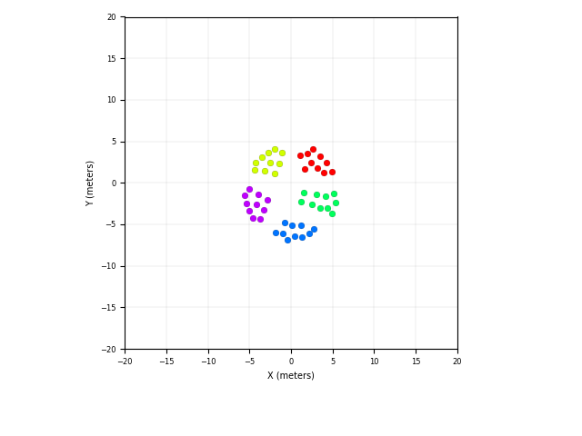
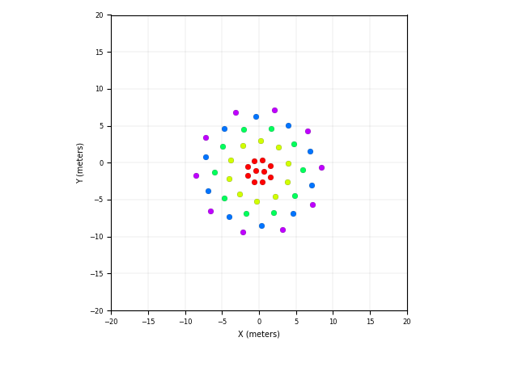

# 2020-swarm-intelligence-segregation
Segregation of Multiple Heterogeneous Units in a Robotic Swarm.

This repository contains the code for control algorithm describe in the paper:

```Spatial segregative behaviors in robotic swarms using differential potentials```


## Dependencies
```
- python3
- matplotlib
- numpy
- scipy
- argparse
- progressbar
- termcolor
```

## How to execute
```sh
$ python3 start.py --help 
usage: start.py [-h] [--robots ROBOTS] [--groups GROUPS]
                [--iterations ITERATIONS] [--behavior BEHAVIOR]
                [--steps STEPS] [--world WORLD] [--alpha ALPHA] [--dAA DAA]
                [--dAB DAB] [--noise_sensor NOISE_SENSOR]
                [--noise_actuation NOISE_ACTUATION]
                [--sensing_radius SENSING_RADIUS] [--seed SEED]

Segregation using potential differential.

optional arguments:
  -h, --help            show this help message and exit
  --robots ROBOTS       Total number of robots.
  --groups GROUPS       Total number of group of robots.
  --iterations ITERATIONS
                        Total number of iterations on the control.
  --behavior BEHAVIOR   Choice between cluster (default) and radial
  --steps STEPS         Time-step on the control.
  --world WORLD         Size of the enviroment in meters
  --alpha ALPHA         Control gain. See the paper for more information.
  --dAA DAA             Same-type robot interaction factor. See the paper for
                        more information.
  --dAB DAB             Differente-type robot interaction factor. See the
                        paper for more information.
  --noise_sensor NOISE_SENSOR
                        Add gaussian noise (max 1.0) on sensor model.
  --noise_actuation NOISE_ACTUATION
                        Add gaussian noise (max 1.0) on actuator model.
  --sensing_radius SENSING_RADIUS
                        Limit the sensing radius.
  --seed SEED           Random seed.
```

## Example of use
### Cluster behavior
```sh
$  python3 start.py --robots 50 --groups 5 --iterations 500 --world 20 --dAA 5 --dAB 7.5 --behavior "cluster"
```


### Radial behavior
```sh
$  python3 start.py --robots 50 --groups 5 --iterations 500 --world 20 --dAA 5 --dAB 7.5 --behavior "radial"
```


# How to cite this work
```
@article{santos2020spatial,
  title={Spatial segregative behaviors in robotic swarms using differential potentials},
  author={Santos, Vinicius G and Pires, Anderson G and Alitappeh, Reza J and Rezeck, Paulo AF and Pimenta, Luciano CA and Macharet, Douglas G and Chaimowicz, Luiz},
  journal={Swarm Intelligence},
  volume={14},
  number={4},
  pages={259--284},
  year={2020},
  publisher={Springer}
}
```